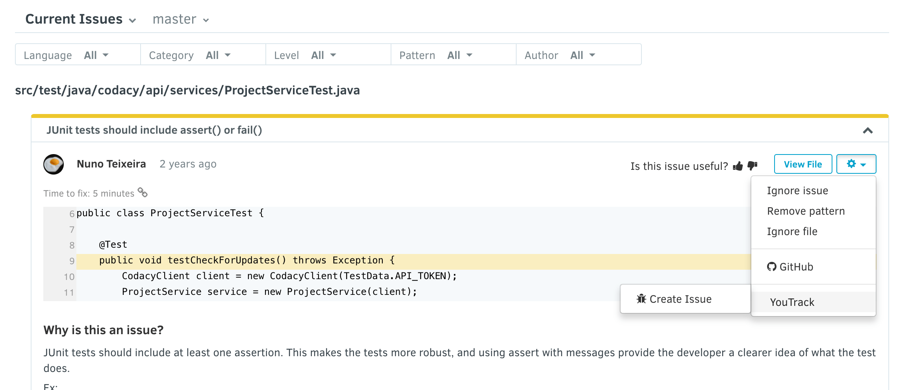

# Bitbucket Cloud Integration

If you're seeing a warning about your Bitbucket Cloud integration being disabled you will need to enable it again by going to your repository **Settings** -> **Integrations**. Please note that you need to have Admin permissions in both Codacy and Bitbucket Cloud to do this. 

Once the integration is done, Codacy will restart analysing your repository and you can add some other useful feature such as pull request status, comments or summary directly in Bitbucket Cloud.

For private repositories, this user will by default become the Bitbucket Cloud user that Codacy will use to comment and create issues on Bitbucket Cloud. For public repositories, comments made by Codacy will appear as coming from codacy-bot.

 

Enabling Bitbucket Cloud integration

Be aware that when clicking "Enable", you will be required to move back and forth between Codacy and Bitbucket Cloud if additional permissions are required.

After enabling the Bitbucket Cloud integration, you will have additional options when browsing the existing issues on the repository:

