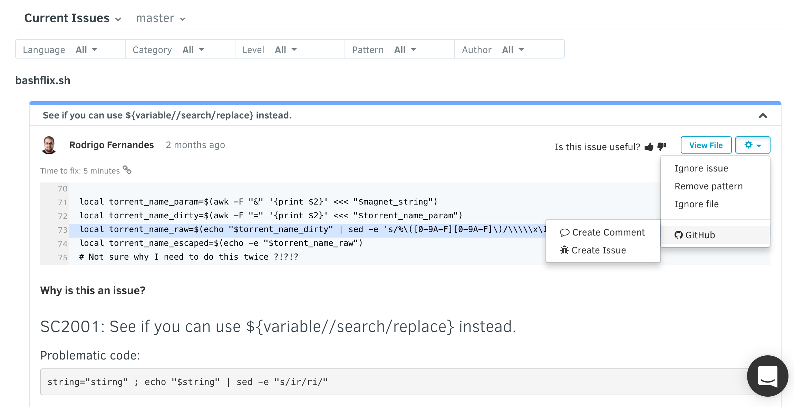
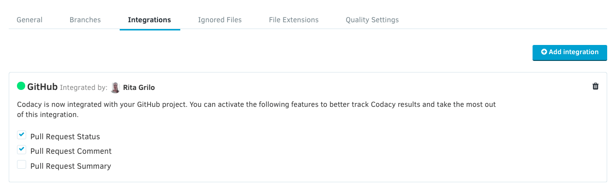
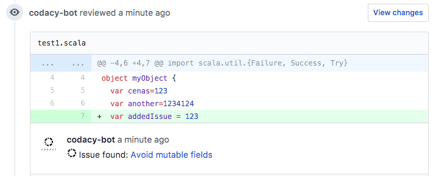
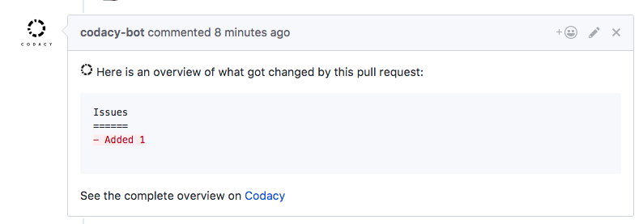

# GitHub Integration

After adding a repository, navigate to your repository's** Settings -> Integrations** tab to enable GitHub integration for comments on pull requests, issue creation, and more.

It installs in just one click but you may need to move back and forth between Codacy and GitHub if it requires additional permissions.

After installing it for a repository, it has to be enabled by a user with repository access on GitHub. For private repositories, this user will by default become the GitHub user that Codacy will use to comment and create issues on GitHub. For public repositories, comments made by Codacy will appear as coming from codacy-bot.

<figure>
<figcaption>Enabling GitHub integration</figcaption>
</figure>

Once the integration is enabled, you will see additional options when browsing the existing issues on the repository:

GitHub integration

Enabling **Pull Request Status**, **Pull Request Comment** or **Pull Request Summary** Codacy will automatically update pull requests on GitHub with additional information when accepting pull requests.

**Pull Request Comment** makes a comment on the Pull Request line when a new issue is found and shows the pattern raising the issue. Click on the Issue link to go to Codacy to see more details about the issue and how to fix it.

Pull request comment

**Pull Request Summary** shows an overall view of the changes in the PR. Including newly found issues and other metrics such as complexity and duplication. 

Pull request summary
