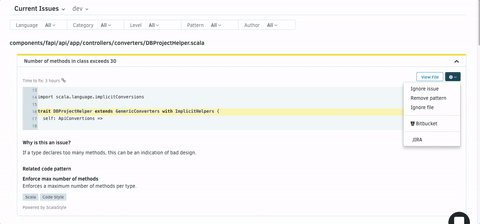

# JIRA

After adding a repository, you may want to enable JIRA integration, to manually create issues on your JIRA board. 

To set up, navigate to your repository's **Settings > Integrations,** fill in all the fields, and click on **Save**.

The integration only support the Basic authentication method. Use your email as username and an API token as the password. Follow the instructions to [generate a JIRA API
token](https://confluence.atlassian.com/x/Vo71Nw).

Once the JIRA Integration is set up, browse to **Settings**, select Advanced, and make sure to fill in all the fields, including the Labels.  

Create an issue on JIRA

After configuring your JIRA integration with your server settings, you will have additional options when browsing the existing issues on the repository that allow you to create JIRA issues for results found on Codacy:

