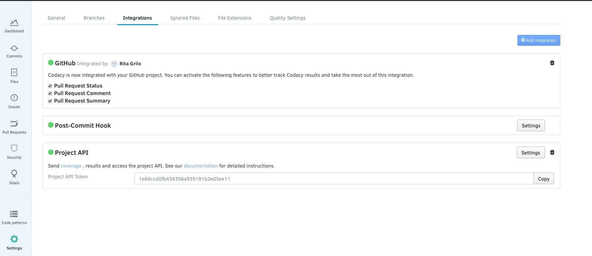

# Project API

The Codacy API offers specific methods to manipulate repositories. You access these by using a Project API Token generated for your repository.

Creating a **Project API** integration in your repository **Settings** tab will generate an API Token valid for that repository.

To revoke a Token, remove the integration.
