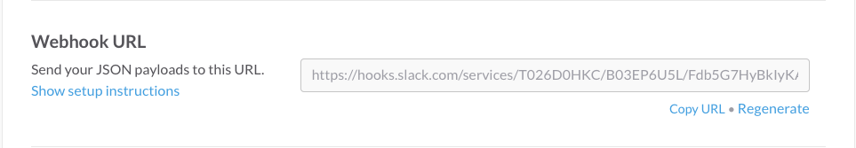
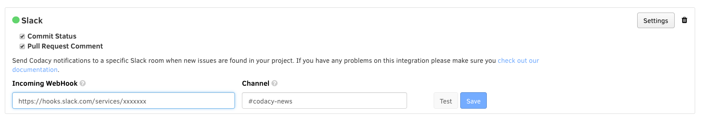

# Slack

After adding a repository, you may want to enable Slack integration. Codacy integrates with Slack by sending messages to a channel when new issues are found.

To enable the Slack integration access the **Integrations** tab of your repository **Settings**, click on "Add integration" and select "Slack" from the list.

 
Enabling Slack integration

## Configuration

**Incoming WebHook**

To set up a new WebHook:

1.  Access the "Incoming WebHooks" page on the App Directory of your Slack account.
2.  Select the channel where you want to be notified and click "Add Incoming WebHooks Integration"
3.  Copy the generated URL and use it on Codacy.

4.  Save Settings on Slack

**Channel**

The name of the channel where the notifications will be sent. This value is optional and it will override the default channel of the WebHook.

After filling both fields you need to click the Save button and everything should be setup correctly.
You can use the Test button to send a test notification to your Slack channel.

Refresh Codacy page to see the green light.

After configuring your Slack integration with your server settings, Codacy will start commenting on Slack whenever it finds new issues.

