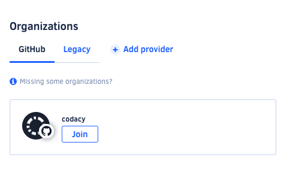

# Authors vs Members

With the new Synced Organizations, we introduced the concept of an Author. This article explains the main differences between an Author and a Member and how a user can change from one to the other.

Regarding the analysis of commits, as soon as an [Author is added](/hc/en-us/articles/360010922420-Adding-and-managing-Authors) all commits made with that email will be analyzed by Codacy as if you were a normal Member. If your normal workflow doesn't include using Codacy's UI and instead you work with the information sent to the Git provider, being an Author is the perfect fit for you.

On the other hand, if you are interested on the information available on Codacy's UI, be it regarding issues detected, patterns being used, or the current settings of a repository, you will have to become a Member of the organization. To do so, click "Organizations" on the top right-hand menu under your avatar and you will see a list of organizations that you can join:

As soon as you join the organization you will be added as a Member and removed from the Authors list, if your email was there.

As a Member, you will be able to see the organization's repositories on Codacy, add new ones to be analyzed, and check each the details of each repository.
