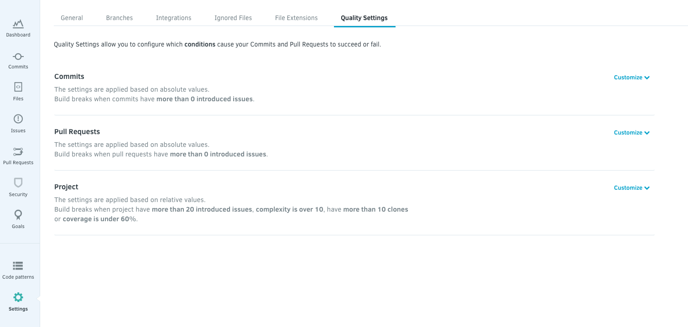

# Issues View

Here you get an overview of all issues raised by Codacy in your repository. We arrange them in six categories. For every issue, we present information on why is this an issue, how you could solve it, and the related code pattern&lt;.

The Issues View

An issue expanded

## 1. Issue Categories

-   **Security:** security issues, potential vulnerabilities, unsafe dependencies.
-   **Error** **Prone:** bad practices/patterns that cause code to fail/prone to bugs.
-   **Code Style:** related to the style of the code, line length, tabs vs spaces.
-   **Compatibility:** identifies code that has problems with older systems or cross platform support.
-   **Unused Code:** unnecessary code not being used.
-   **Performance:** inefficiently written code.

## 2. Issue Level

-   **Info:** The least critical issue type will appear as blue; for example code style issues are shown this way.
-   **Warning:** This issue type will appear as yellow. You should be careful with these ones, they are based on code standards and conventions.
-   **Error:** The more dangerous types of issues will show as red. Take your time to fix these, although the code may run, these issues show the code that is very susceptible to problems. These issues are bug-prone, and/or can have serious problems regarding security and compatibility.

Each pattern has a pre-defined severity level and at the moment, it’s not possible to customize that information.

## 3. Ignoring an issue

For an issue you disagree with or false positives, you can either ignore that instance or disable the pattern across the whole repository. To do so, click on  and select the desired option.

### 3.1. Reinstating ignored issues

To reinstate ignored issues, click on the **Current Issues** box, and select **Ignored Issues** from the drop-down menu.

## 4. Removing a pattern

When you want to remove a pattern altogether from your repository's analysis, expand the issue you’re aiming to disable the pattern for, click on , select **Remove pattern** and confirm your choice.

!!! note
    If you’re using a custom [configuration file](/hc/en-us/articles/207994335#4-configuration-files), you have to remove that pattern line manually in your file.

### 4.1. Restoring a removed pattern

To restore a removed pattern, go to your repository's **Code Pattern** settings, choose the tool you’d like to enable the pattern for, find the pattern and click on the check box to enable.

!!! note
    If you’re using a custom pattern configuration file, have to restore the line manually.

## 5. Ignoring files

You can cherry-pick files to be ignored for further analysis. To ignore a file, expand the issue, click on , select **Ignore file** from the menu, and confirm.

!!! warning
    This file is now ignored across the entire repository and for all patterns.

### 5.1. Managing ignored files

Ignored files are managed through **Settings > Ignore Files**.

For more information on this topic, have a look at this [article](/hc/en-us/articles/360005097654-Ignore-files-from-Codacy-analysis).

## 6. Create a Comment in your repo

You can also add comments to the code on Codacy, and it will sync in your repository on [GitHub](/hc/en-us/articles/207280219-GitHub-Integration) or [Bitbucket](/hc/en-us/articles/207280239-Bitbucket-Integration).
