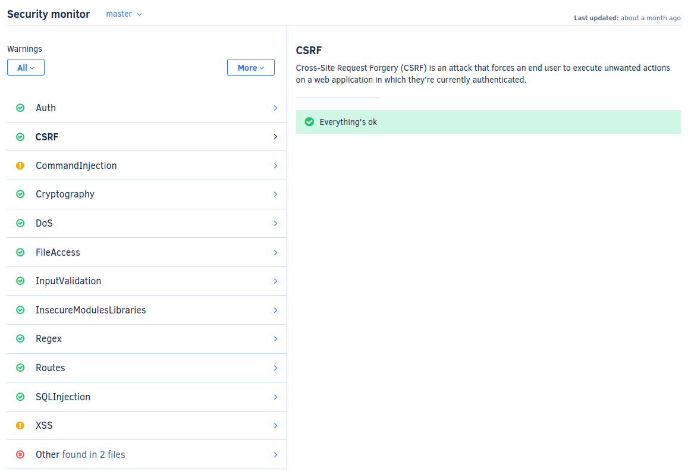
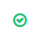
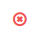

# Security Dashboard

On the security dashboard, you get an overview of all current security alerts.

## Supported languages

The security monitor is available for the following languages:

-   Apex
-   C#
-   Java
-   JavaScript
-   Python
-   Ruby
-   Scala
-   PHP
-   C
-   C++
-   Shell script
-   Dockerfile
-   Visual Basic
-   Elixir
-   PowerShell
-   TSQL
-   Groovy

## Tools

The security monitor is built using security patterns from:

-   [Bandit](https://bandit.readthedocs.io/en/latest/plugins/index.html#complete-test-plugin-listing)
-   [Brakeman](http://brakemanscanner.org/docs/warning_types/)
-   [Codacy Scalameta Pro](https://github.com/codacy/codacy-scalameta/tree/master/patterns-base/src/main/scala/codacy/patterns)
-   [ESLint](https://www.npmjs.com/package/eslint-plugin-security) (also:
      [1](https://www.npmjs.com/package/eslint-config-nodesecurity),
      [2](https://www.npmjs.com/package/eslint-plugin-scanjs-rules),
      [3](https://www.npmjs.com/package/eslint-plugin-no-unsafe-innerhtml) and [4](https://www.npmjs.com/package/eslint-config-secure))
-   [FindBugs](http://findbugs.sourceforge.net/bugDescriptions.html) (Codacy
      Self-hosted only)
-   [FindBugsSecurity](https://find-sec-bugs.github.io/bugs.htm) (Codacy
      Self-hosted only)
-   [SpotBugs](https://spotbugs.readthedocs.io/en/latest/bugDescriptions.html) (Codacy
      Self-hosted only)
-   [Sonar C#](https://rules.sonarsource.com/csharp/type/Vulnerability)
-   [Sonar VB.NET](https://rules.sonarsource.com/vbnet)
-   [PMD](https://pmd.github.io/pmd-6.21.0/)
-   [PHP Mess Detector](https://phpmd.org/rules/)
-   [Pylint](http://pylint.pycqa.org/en/1.9/technical_reference/features.html)
      (Python 2)
-   [Pylint](http://pylint.pycqa.org/en/stable/technical_reference/features.html)
      (Python 3)
-   [RuboCop](https://rubocop.readthedocs.io/en/latest/cops/)
-   [Cppcheck](http://cppcheck.sourceforge.net/)
-   [Shellcheck](https://github.com/koalaman/shellcheck/wiki/Checks)
-   [PHP CodeSniffer](https://github.com/squizlabs/PHP_CodeSniffer)
-   [Hadolint](https://github.com/hadolint/hadolint#rules)
-   [Prospector](https://github.com/PyCQA/prospector)
-   [Bundler-audit](https://rubydoc.info/gems/bundler-audit/frames)
-   [Credo](https://github.com/rrrene/credo/)
-   [FlawFinder](https://dwheeler.com/flawfinder/)
-   [PSScriptAnalyzer](https://dwheeler.com/flawfinder/)
-   [TSQLLint](https://github.com/tsqllint/tsqllint/)
-   [CodeNarc](https://codenarc.github.io/CodeNarc/codenarc-rule-index.html)

## Supported categories

-   **XSS:** XSS enables attackers to inject client-side scripts into web pages viewed by other users.
-   **Input validation:** Input not validated may originate SQL Injection attacks for instance.
-   **File access:** An attacker may use special paths to access files that should not be accessible.
-   **HTTP&#x3A;** HTTP headers are a common attack vector for malign users.
-   **Cookies:** An HTTP cookie is a small piece of data sent from a website and stored on the user's computer by the browser while the user is browsing.
-   **Unexpected behaviour:** Assigning values to private APIs might lead to unexpected behaviour.
-   **Mass assignment:** Mass assignment is a feature of Rails which allows an application to create a record from the values of a hash.
-   **Insecure storage:** Storing sensitive data using this APIs is not safe.
-   **Insecure modules/libraries:** Consider possible security implications associated with some modules.
-   **Visibility:** Fields should not have public accessibility.
-   **CSRF:** Cross-Site Request Forgery (CSRF) is an attack that forces an end user to execute unwanted actions on a web application in which they're currently authenticated.
-   **Android:** Android specific issues.
-   **Malicious code:** Exposed internal APIs can be accessed or change changed by malicious code or by accident from another package.
-   **Cryptography:** Cryptography is a security technique widely used and there are several cryptographic functions, but not all of them are secure.
-   **Command injection:** Command injection is an attack in which the goal is the execution of arbitrary commands on the host operating system.
-   **Firefox OS:** Sensitive APIs of Firefox OS.
-   **Auth:** Authentication is present in almost all web applications nowadays.
-   **DoS:** The Denial of Service (DoS) attack is focused on making a resource (site, application, server) unavailable for the purpose it was designed.
-   **SQL injection:** A SQL injection attack consists of insertion or 'injection' of a SQL query via the input data from the client to the application.
-   **Routes:** Badly configured routes can give unintended access to an attacker.
-   **Regex:** Regex can be used in a Denial of Service attack, that exploits the fact that most Regular Expression implementations may reach heavy computation situations that cause them to work very slowly (exponentially related to input size).
-   **SSL:** Simply using SSL isn't enough to ensure the data you are sending is secure. Man in the middle attacks are well known and widely used.
-   **Other:** Other language specific security issues.

## Category states

Each security category listed on the left-hand side of the dashboard has one of four states:

|                               |                                                                                                                                                                                                                  |
| ----------------------------- | ---------------------------------------------------------------------------------------------------------------------------------------------------------------------------------------------------------------- |
|    | A green check mark means that **everything is OK** for this category: all the security patterns in this category are enabled, and no security issues have been found.                                            |
|  | A yellow exclamation mark means that **there are security patterns in this category that are disabled**. You should enable the patterns in this category so it is verified.                                      |
|        | A red cross means that **there are security issues identified** for this category.                                                                                                                               |
|                               | A blue info icon means that **Codacy cannot be sure if you have all the security patterns in this category enabled**. This happens when you are using configuration files to control which patterns are enabled. |

## Additional features

On the Security dashboard view you can also:

-   Enable all the security patterns for that repository with one click 
-   Download all the patterns in a CSV file (this will give you a list of all the patterns considered by Codacy under the security category)

You just have to go to your repository's Security Tab, click on  and select the relevant option.

