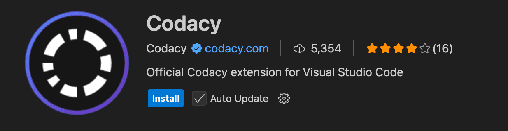
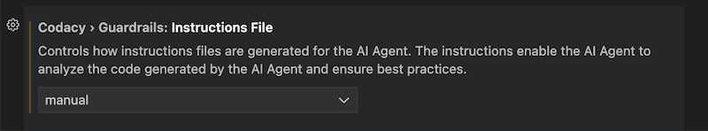
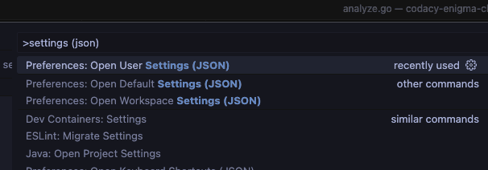
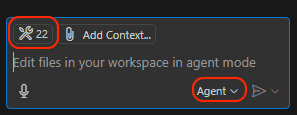
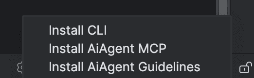
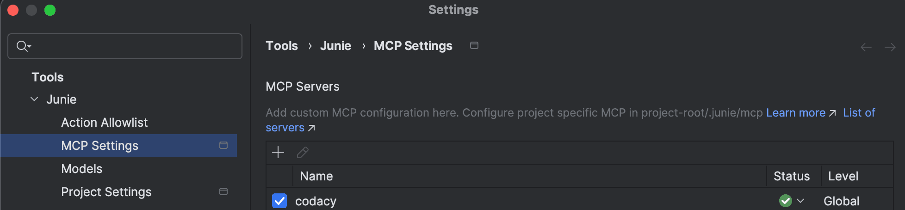

Codacy Guardrails is a brand new way of enforcing code security and quality standards for AI-generated code, built into the free Codacy IDE Extension for VSCode, Copilot, Cursor, and Windsurf. Guardrails help developers ship safer, cleaner AI code by applying best practices and blocking insecure patterns while the code is being generated.

Besides real-time AI code scanning, Guardrails users can now prompt all their Codacy findings, without ever leaving the AI chat panel inside their IDE.

**New to Codacy Guardrails?** [Check our blog post](https://blog.codacy.com/codacy-guardrails-free-real-time-enforcement-of-security-and-quality-standards)

<iframe width="560" height="315" style="height: 315px" src="https://www.youtube.com/embed/uVyRWnnJu-0?si=Pnbk65EvpvvJRXX4" title="YouTube video player" frameborder="0" allow="accelerometer; autoplay; clipboard-write; encrypted-media; gyroscope; picture-in-picture; web-share" referrerpolicy="strict-origin-when-cross-origin" allowfullscreen></iframe>


# VSCode-based IDEs

## Prerequisites

- git
- node.js - ensure the `npx` command runs without issues
- curl

### Supported Operating Systems

- macOS
- Linux
- Windows (via WSL)

:::caution
**For Windows users: Windows WSL** (a feature that allows you to run a Linux environment directly on Windows, without the need for a virtual machine or dual-boot setup) is the only way you can use this feature for now, but we're still working to fully support Windows.
We currently only support VSCode, Cursor, and Windsurf on Windows.
:::


### Supported IDEs

- Visual Studio Code
- Cursor
- Windsurf

:::note
For Visual Studio Code, the Insiders version is recommended for its faster performance and compatibility with Codacy Guardrails. However, since it's a beta version, you may encounter occasional issues.
:::

### Built-in Scanners

- Trivy
- Semgrep
- ESLint
- Pylint
- PMD
- dartanalyzer
- [Lizard](https://docs.codacy.com/release-notes/cloud/cloud-2025-02-adding-ruff-lizard/#lizard)
- Revive

## How to install - Quick Guide {#how-to-install-quick-guide}

#### Note for Windows users:
To take advantage of Codacy Guardrails on Windows, you might need to setup WSL first, [check the steps here.](#how-to-install-wsl)

### 1.  Download the extension

- [Visual Studio Code](https://tinyurl.com/codacy-vscode-extension)
- [Cursor](http://tinyurl.com/codacy-cursor)
- [Windsurf](http://tinyurl.com/codacy-windsurf)
- [IntelliJ IDEA](https://tinyurl.com/codacy-jetbrains-extension)

This will open the Codacy Extension in your IDE Marketplace. Click **Install**




### 2. Install and activate the Codacy CLI for local analysis

Click on the button **Install Codacy CLI**


It will create a folder in your local repository called **.codacy** with all needed configuration:

-  The configuration from all built-in scanners
-  Codacy CLI script to run analysis locally 

:::note
If you don't want this folder to be part of your repository in future commits but continue working with it locally, please add **.codacy** to your .gitignore file
:::

:::note
The IDE extension will ignore any CLI version already installed (e.g. through brew or other package manager) on the machine.
:::


### 3. Check if the Codacy MCP Server is properly setup

Codacy MCP Server will be installed automatically when starting the extension, and an instructions file will be created in your workspace. 

If you don't want Guardrails to automatically generate the instructions file, go to the extension's settings and set the instructions generation setting to manual.



:::caution
The absence of the instructions file will impact the Guardrails experience.
:::

You can later generate the instructions manually from the Guardrails section of the extension.


### 4. After everything is set up, you should now be able to interact with Codacy via AI chat.
* Remember that for you to be able to interact with Codacy MCP server, you must be on the `Agent` mode of the chat, not the default `Ask` mode.
* If you're still having issues with the MCP server, try to run the command `Preferences: Open User Settings (JSON)`, look for the Codacy MCP server settings and right on top of it you'll should see a `Start` option. Click on it and, if unsuccessful, go to `View > Debug Console` and check for errors. Don't forget to ensure you have `node.js` and `npx` installed and set up.

## How to install - WSL {#how-to-install-wsl}

### 1. Install or update [WSL.](https://learn.microsoft.com/en-us/windows/wsl/install)

### 2. Install `curl` on your WSL instance if it's not installed already.
* This will depend on the Linux distribution you are using, but for example in Debian and Ubuntu the command will be something like `sudo apt update && sudo apt install curl`. Execute the command on a WSL terminal.

### 3. Now you should be able to install the Codacy extension without issues. Go through the steps [here](#how-to-install-quick-guide).

## How to install - Manually

### 1.  Install and activate the Codacy CLI for local analysis {#install-cli}

#### Download

##### MacOS (brew)

To install `codacy-cli` using Homebrew:

```bash
brew install codacy/codacy-cli-v2/codacy-cli-v2
```

##### Linux

For Linux, we rely on the **codacy-cli.sh** script in the root. To download the CLI, run:

```bash
bash <(curl -Ls https://raw.githubusercontent.com/codacy/codacy-cli-v2/main/codacy-cli.sh)
```
You can either put the downloaded script in a specific file or create an alias that will download the script and look for changes:

```bash
alias codacy-cli="bash <(curl -Ls https://raw.githubusercontent.com/codacy/codacy-cli-v2/main/codacy-cli.sh)"
```

#### Installation

Before running the analysis, install the specified tools:

```bash
codacy-cli install
```

### 2. Install MCP Server {#install-mcp-server}

If you want to use MCP Server with a NPM package you should download it from [here](https://www.npmjs.com/package/@codacy/codacy-mcp)

:::caution
You can find some limitations using this approach because the AI doesn't automatically analyse the code generated unless there's a rule set for it to do so. When using the IDE extension (VS Code, Cursor, or Windsurf), we create those AI rules for the workspace, but if you are installing the MCP manually, you will need to create those rules by yourself. <a href="mailto:support@codacy.com">Let us know if you you plan to use this approach, so we can provide more information</a>
:::

#### Setup

##### Cursor, Windsurf and Claude Desktop

Depending on what IDE you are connecting the MCP Server to, you can use the following methods:

- Cursor: edit the `.cursor/mcp.json` file to add the following
- Windsurf: edit the `.codeium/windsurf/mcp_config.json` file to add the following
- Claude Desktop: edit the `claude_desktop_config.json` file to add the following

```json
{
  "mcpServers": {
    "codacy": {
      "command": "npx",
      "args": ["-y", "@codacy/codacy-mcp"],
      "env": {
        "CODACY_ACCOUNT_TOKEN": "<YOUR_TOKEN>",
        "CODACY_CLI_VERSION": "<VERSION>"
      }
    }
  }
}
```

##### VS Code with Copilot

For connecting the MCP Server to Copilot in VS Code, add the following to the global config of the IDE:

```json
{
  "mcp": {
    "inputs": [],
    "servers": {
      "codacy": {
        "command": "npx",
        "args": ["-y", "@codacy/codacy-mcp"],
        "env": {
          "CODACY_ACCOUNT_TOKEN": "<YOUR_TOKEN>",
          "CODACY_CLI_VERSION": "<VERSION>"
        }
      }
    }
  }
}
```

You can open the user settings.json file in:

`View > Command Palette > Preferences: Open User Settings (JSON)`

Or open the general settings.json file directly, which according to your OS should be located in:

- for macOS: `~/Library/Application Support/Code/User/settings.json`
- for Windows: `%APPDATA%\Code\User\settings.json`
- for Linux: `~/.config/Code/User/settings.json`



Make sure you update the value of `CODACY_ACCOUNT_TOKEN` with your [API token](../codacy-api/api-tokens.md).

a. Above the MCP Server configuration in **Settings.json** file, you can Click in the command **Start**

 

b. Make sure you have Agent mode enabled: [vscode://settings/chat.agent.enabled](vscode://settings/chat.agent.enabled)

c. Open the Copilot chat and switch the mode to `Agent`. You can check that the MCP server was enabled correctly by clicking on the `Select tools` icon, which should list all the available Codacy tools.




# JetBrains IDEs


### Supported Operating Systems

- macOS
- Linux
- Windows (via WSL)

:::caution
**For Windows users: Windows WSL** (a feature that allows you to run a Linux environment directly on Windows, without the need for a virtual machine or dual-boot setup) is the only way you can use this feature for now, but we're still working to fully support Windows. **Only local analysis** are supported for Windows, as MCP support for JetBrains IDEs is still not completely done.
:::


### Supported IDEs

- IntelliJ IDEA
- PyCharm
- PhpStorm
- Others in the suite

:::note
For JetBrains IDEs, IntelliJ isn't the only supported editor, but is our primary focus. If you use other editors such as PyCharm and run into any issues, feel free to open an issue in our extension's [repository](https://github.com/codacy/codacy-intellij-extension). Check the [extension page](https://tinyurl.com/codacy-jetbrains-extension) on the marketplace to see the full list of supported IDEs.
:::

### Built-in Scanners

- Trivy
- Semgrep
- ESLint
- Pylint
- PMD
- dartanalyzer
- [Lizard](https://docs.codacy.com/release-notes/cloud/cloud-2025-02-adding-ruff-lizard/#lizard)
- Revive

## How to install - JetBrains Quick Guide {#how-to-install-quick-guide-jetbrains}

#### Note for Windows users:
To take advantage of Codacy Guardrails on Windows, you need to set up WSL first; [check the steps here](#how-to-install-wsl). **Only local analysis** are supported for Windows, as MCP support for JetBrains IDEs is still not completely done.

### 1.  Install the extension

You can either install the dependency from the [JetBrains marketplace](https://tinyurl.com/codacy-jetbrains-extension) or search for it directly in your Codacy plugin's settings.

:::note
If you don’t see the Codacy plugin icon on the left taskbar after installing it, go to View > Tool Windows > Codacy
:::


### 2. Install and activate the Codacy CLI for local analysis

Click on the Codacy button on the lower right part of your IDE, and click **Install CLI**



It will create a folder in your local repository called **.codacy** with all needed configuration:

-  The configuration from all built-in scanners
-  Codacy CLI script to run analysis locally 

:::note
If you don't want this folder to be part of your repository in future commits but continue working with it locally, please add **.codacy** to your .gitignore file
:::

:::note
The IDE extension will ignore any CLI version already installed (for example, through brew or other package manager) on the machine.
:::


### 3. Install MCP Server

#### a. Add the Codacy MCP Server

After clicking on the Codacy icon on the lower right of the editor, click on **Install AiAgent MCP**


#### b. Check if the Codacy MCP Server is enabled

In your IntelliJ settings, search the settings for the agent of your choice (Junie or Copilot) and confirm that Codacy is listed on the MCP settings tab.



:::note
You need to install the plugin for your desired agent. Make sure to install JetBrains Junie or GitHub Copilot if you want to integrate the Codacy MCP.
:::

#### c. Confirm the settings of your Codacy extension

In your IntelliJ settings, search the settings for the Codacy extension and confirm that you're using the correct version of the CLI, as well as your preferred AI agent. 

If you want Codacy to generate the AI agent guidelines (which will instruct the agent to run the Codacy local analysis on changes, for example) for you, you should also enable this option in the editor settings.


#### d. Generate AI guidelines
Install the guidelines by clicking on **Install AiAgent Guidelines** on the Codacy icon on the lower right part of your IDE.


:::note
You need to install the plugin for your desired agent. Make sure to install JetBrains Junie or GitHub Copilot if you want to integrate the Codacy MCP.
:::

### 4. Restart your IDE to apply changes

### 5. After everything is set up, you should now be able to interact with Codacy via AI chat.
* Remember that for you to be able to interact with the Codacy MCP server, you must be on the `Agent` mode of the chat (`Code` on Junie), not `Ask` nor `Edit` mode.

### 6. Start using your Agent and Codacy will be there with you!


