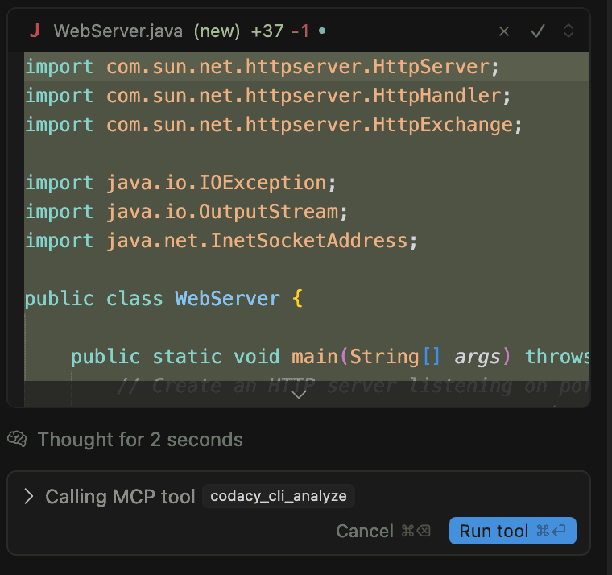
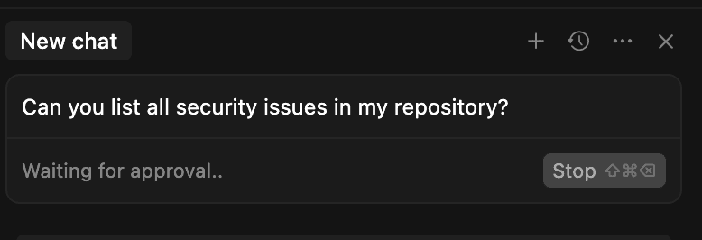
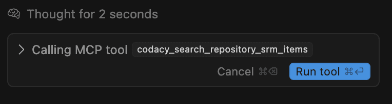
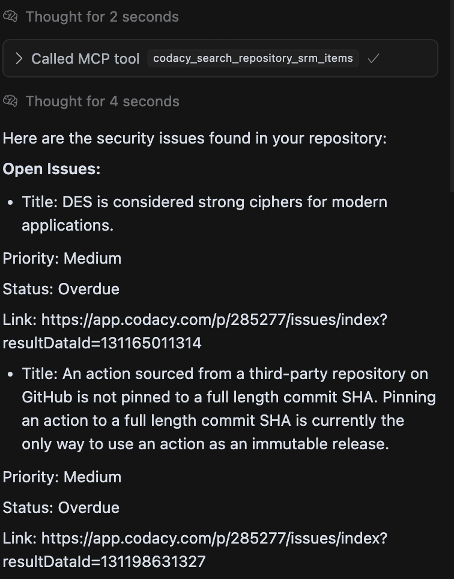

## Recommended configurations

<table>
  <thead>
    <tr>
	      <th>IDE</th>
	      <th>Recommended LLM</th>
	    </tr>
	  </thead>
  <tbody>
  <tr>
    <td>Visual Studio Code</td>
    <td>Claude 3.x Sonnet</td>
  </tr>
    <tr>
    <td>Visual Studio Code Insiders</td>
    <td>Claude 4.x Sonnet</td>
  </tr>
  <tr>
    <td>Cursor</td>
    <td>Claude 4.x Sonnet</td>
  </tr>
  <tr>
    <td>Windsurf</td>
    <td>Claude 3.x Sonnet</td>
  </tr>
  </tbody>
</table>

## Write secure, compliant AI code

a. Let's run an prompt to create a webserver in Java

```text
Create a lightweight webserver in Java.
```


In response, it generated a compact, readable Java class using ServerSocket and raw streams to handle HTTP requests. Here’s what I got:



b. There's a call from MCP tool to analyse the code that was generated. Click in **Run tool**

Codacy Guardrails starts analyzing it automatically using the Codacy CLI embedded in the agent’s flow. No configurations, no extra steps–it just works.

It found an issue with PMD - the package name isn't correctly declared - and it will try to fix that with the right declaration.


c. After a new analysis, It shows us that it has 0 issues in the code


## Prompt Codacy from your IDE chat panel

Once your repository is connected to Codacy, you can go beyond traditional static analysis and start interacting with your codebase using natural language prompts.

a. Let's run a quick example with the prompt:

```text
Can you list all security issues in my repository?
```



b. Right after running this prompt, there is a MCP tool call to search all security issues in my repository. Click in **Run tool**



It will search for all open security issues in my repository. And it will list all them, showing the **title**, **priority**, **status** and the **link to the issue**, 



It turned security from a checklist into a dialogue—and that changes everything.
