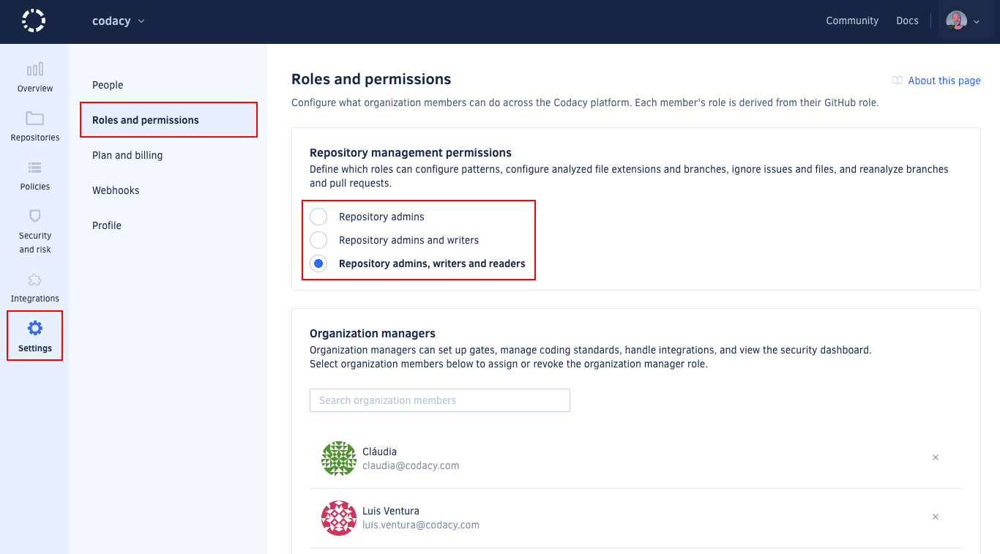

import AdminAccessInfo from './../_includes/AdminAccessInfo.mdx'

By default, Codacy assigns each organization member a role corresponding to that member's role on your Git provider. Each Codacy role, from most restrictive (repository read) to most capable (organization admin), corresponds to a set of permissions that determine what each member can do on Codacy.

To update a member's role on Codacy, update that member's role on your Git provider. When next logging in to Codacy, the member is assigned the new role.

Organization admins can also grant additional permissions:

-   To roles, by [configuring repository management permissions](#change-analysis-configuration)
-   To individual members, by [assigning the organization manager role](#managing-the-organization-manager-role)

To review the permissions granted by each role, see the tables for each Git provider:

-   [Permissions for GitHub](#permissions-for-github)
-   [Permissions for GitLab](#permissions-for-gitlab)
-   [Permissions for Bitbucket](#permissions-for-bitbucket)

To list and manage the members of your Codacy organization, see the [Managing people](managing-people.md) page.

## Configuring repository management permissions \{#change-analysis-configuration\}
<AdminAccessInfo />

By default, only users with the Codacy role **repository write** can change analysis configurations.

To change this, open your organization **Settings**, page **Roles and permissions**, and choose the Codacy roles that can perform the following operations on the repositories of your organization:

-   [Ignore issues](../repositories/issues.md#ignoring-and-managing-issues)
-   [Ignore files](../repositories-configure/ignoring-files.md)
-   [Configure code patterns](../repositories-configure/configuring-code-patterns.md)
-   [Configure languages](../repositories-configure/languages.md)
-   [Manage branches](../repositories-configure/managing-branches.mdx)
-   [Reanalyze branches and pull requests](../faq/repositories/how-do-i-reanalyze-my-repository.md)
-   [Create targets and run Dynamic Application Security Testing scans](../organizations/managing-security-and-risk.md#app-scanning)

## Managing the organization manager role

<AdminAccessInfo />

To grant an organization member additional permissions, you can assign that member the organization manager role. This role isn't influenced by a member's Git provider role.

To review the additional permissions granted by the organization manager role, see the tables for each Git provider ([GitHub](#permissions-for-github), [GitLab](#permissions-for-gitlab), [Bitbucket](#permissions-for-bitbucket)).

:::note
Organization managers can access the **Policies** and **Integrations** settings sections of your organization and can therefore impact some repository settings for all repositories of your organization, even repositories that they can't access on the Git provider. However, they can't access the repositories themselves and can only see the repository names.
:::

### Assigning the organization manager role

To assign the organization manager role:

1.  Open your organization **Settings**, page **Roles and permissions**.

1.  In the **Organization managers** area, use the search field to find the relevant organization member and click the member's name.

    :::note
    You can only assign the organization manager role to [members of your organization](./managing-people.md#joining).
    :::

    

### Revoking the organization manager role

To revoke the organization manager role:

1.  Open your organization **Settings**, page **Roles and permissions**.

1.  In the **Organization managers** area, scroll the list to find the relevant user.

1.  Click the **Revoke role icon** to the right of the user's name and confirm.

## Permissions for GitHub

The table below maps the GitHub Cloud and GitHub Enterprise roles to the corresponding Codacy roles and the operations that they're allowed to perform:

<table>
  <thead>
    <tr>
      <th>GitHub role</th>
      <th>Outside collaborator1</th>
      <th>Repository read</th>
      <th>Repository triage</th>
      <th>Repository write</th>
      <th>Repository maintain</th>
      <th>Repository admin</th>
      <th>-</th>
      <th>Organization Owner</th>
    </tr>
  </thead>
  <tbody>
    <tr>
      <td>Codacy role</td>
      <td>-</td>
      <td colspan="2">Repository read</td>
      <td colspan="2">Repository write</td>
      <td>Repository admin</td>
      <td><a href="#managing-the-organization-manager-role">Organization manager</a></td>
      <td>Organization admin</td>
    </tr>
    <tr>
      <td>Join organization</td>
      <td class="no">No</td>
      <td colspan="2" class="yes">Yes2</td>
      <td colspan="2" class="yes">Yes2</td>
      <td class="yes">Yes2</td>
      <td class="yes">Yes</td>
      <td class="yes">Yes2</td>
    </tr>
    <tr>
      <td>View and follow private repository</td>
      <td class="no">No</td>
      <td colspan="2" class="yes">Yes</td>
      <td colspan="2" class="yes">Yes</td>
      <td class="yes">Yes</td>
      <td class="yes">Yes</td>
      <td class="yes">Yes</td>
    </tr>
    <tr>
      <td>Access Security and risk management</td>
      <td class="no">No</td>
      <td colspan="2" class="yes">Yes3</td>
      <td colspan="2" class="yes">Yes3</td>
      <td class="yes">Yes3</td>
      <td class="yes">Yes</td>
      <td class="yes">Yes</td>
    </tr>
    <tr>
      <td>Ignore issues and files, configure code patterns and languages, manage branches, reanalyze branches and pull requests</td>
      <td class="no">No</td>
      <td colspan="2" class="maybe"><a href="#change-analysis-configuration">Configurable</a></td>
      <td colspan="2" class="maybe"><a href="#change-analysis-configuration">Configurable</a></td>
      <td class="yes">Yes</td>
      <td class="maybe">Inherits original permission</td>
      <td class="yes">Yes</td>
    </tr>
    <tr>
      <td>Upload coverage using an account API token, see the coverage report logs</td>
      <td class="no">No</td>
      <td colspan="2" class="no">No</td>
      <td colspan="2" class="yes">Yes</td>
      <td class="yes">Yes</td>
      <td class="maybe">Inherits original permission</td>
      <td class="yes">Yes</td>
    </tr>
    <tr>
      <td>Configure repository Git provider integration settings</td>
      <td class="no">No</td>
      <td colspan="2" class="no">No</td>
      <td colspan="2" class="no">No</td>
      <td class="yes">Yes</td>
      <td class="maybe">Inherits original permission</td>
      <td class="yes">Yes</td>
    </tr>
    <tr>
      <td>Configure repository quality gates and goals</td>
      <td class="no">No</td>
      <td colspan="2" class="no">No</td>
      <td colspan="2" class="no">No</td>
      <td class="yes">Yes</td>
      <td class="maybe">Inherits original permission</td>
      <td class="yes">Yes</td>
    </tr>
    <tr>
      <td>Enable repository analysis to run on a local build server, manage repository API tokens</td>
      <td class="no">No</td>
      <td colspan="2" class="no">No</td>
      <td colspan="2" class="no">No</td>
      <td class="yes">Yes</td>
      <td class="maybe">Inherits original permission</td>
      <td class="yes">Yes</td>
    </tr>
    <tr>
      <td>Add and remove repository</td>
      <td class="no">No</td>
      <td colspan="2" class="no">No</td>
      <td colspan="2" class="no">No</td>
      <td class="yes">Yes4</td>
      <td class="maybe">Inherits original permission</td>
      <td class="yes">Yes</td>
    </tr>
    <tr>
      <td>Manage organization gate policies and coding standards</td>
      <td class="no">No</td>
      <td colspan="2" class="no">No</td>
      <td colspan="2" class="no">No</td>
      <td class="no">No</td>
      <td class="yes">Yes</td>
      <td class="yes">Yes</td>
    </tr>
    <tr>
      <td>Configure organization default settings for Git provider integration</td>
      <td class="no">No</td>
      <td colspan="2" class="no">No</td>
      <td colspan="2" class="no">No</td>
      <td class="no">No</td>
      <td class="yes">Yes</td>
      <td class="yes">Yes</td>
    </tr>
    <tr>
      <td>Obtain audit logs for organization events5</td>
      <td class="no">No</td>
      <td colspan="2" class="no">No</td>
      <td colspan="2" class="no">No</td>
      <td class="no">No</td>
      <td class="yes">Yes</td>
      <td class="yes">Yes</td>
    </tr>
    <tr>
      <td>Invite and accept members, modify billing</td>
      <td class="no">No</td>
      <td colspan="2" class="no">No</td>
      <td colspan="2" class="no">No</td>
      <td class="no">No</td>
      <td class="no">No</td>
      <td class="yes">Yes</td>
    </tr>
    <tr>
      <td>Assign and revoke the organization manager role</td>
      <td class="no">No</td>
      <td colspan="2" class="no">No</td>
      <td colspan="2" class="no">No</td>
      <td class="no">No</td>
      <td class="no">No</td>
      <td class="yes">Yes</td>
    </tr>
  </tbody>
</table>

1: Outside collaborators aren't supported as members of organizations on Codacy. You can still [add outside collaborators to Codacy](managing-people.md#adding-people) so that Codacy analyzes their commits to private repositories, but they won't be able to join your Codacy organization.  
2: Joining an organization may need an approval depending on your setting for [accepting new people](changing-your-plan-and-billing.md#allowing-new-people-to-join-your-organization).  
3: These users can only see security items originating from Codacy repositories that they follow.  
4: Requires that an organization owner has given the Codacy GitHub App access to the repositories to add or remove.  
5: [Audit logs](./audit-logs-for-organizations.md) are available only on [Business plan](https://www.codacy.com/pricing).

## Permissions for GitLab

The table below maps the GitLab Cloud and GitLab Enterprise roles to the corresponding Codacy roles and the operations that they're allowed to perform:

<table>
  <thead>
    <tr>
      <th>GitLab role</th>
      <th>External user1</th>
      <th>Project guest</th>
      <th>Project reporter</th>
      <th>Project developer</th>
      <th>Project maintainer</th>
      <th>Project owner</th>
      <th>-</th>
      <th>Group owner</th>
      <th>Administrator</th>
    </tr>
  </thead>
  <tbody>
    <tr>
      <td>Codacy role</td>
      <td>-</td>
      <td colspan="2">Repository read</td>
      <td>Repository write</td>
      <td colspan="2">Repository admin</td>
      <td><a href="#managing-the-organization-manager-role">Organization manager</a></td>
      <td colspan="2">Organization admin</td>
    </tr>
    <tr>
      <td>Join organization</td>
      <td class="no">No</td>
      <td colspan="2" class="yes">Yes2</td>
      <td class="yes">Yes2</td>
      <td colspan="2" class="yes">Yes2</td>
      <td class="yes">Yes</td>
      <td colspan="2" class="yes">Yes2</td>
    </tr>
    <tr>
      <td>View and follow private repository</td>
      <td class="no">No</td>
      <td colspan="2" class="yes">Yes</td>
      <td class="yes">Yes</td>
      <td colspan="2" class="yes">Yes</td>
      <td class="yes">Yes</td>
      <td colspan="2" class="yes">Yes</td>
    </tr>
    <tr>
      <td>Access Security and risk management</td>
      <td class="no">No</td>
      <td colspan="2" class="yes">Yes3</td>
      <td class="yes">Yes3</td>
      <td colspan="2" class="yes">Yes3</td>
      <td class="yes">Yes</td>
      <td colspan="2" class="yes">Yes</td>
    </tr>
    <tr>
      <td>Ignore issues and files, configure code patterns and languages, manage branches, reanalyze branches and pull requests</td>
      <td class="no">No</td>
      <td colspan="2" class="maybe"><a href="#change-analysis-configuration">Configurable</a></td>
      <td class="maybe"><a href="#change-analysis-configuration">Configurable</a></td>
      <td colspan="2" class="yes">Yes</td>
      <td class="maybe">Inherits original permission</td>
      <td colspan="2" class="yes">Yes</td>
    </tr>
    <tr>
      <td>Upload coverage using an account API token, see the coverage report logs</td>
      <td class="no">No</td>
      <td colspan="2" class="no">No</td>
      <td class="yes">Yes</td>
      <td colspan="2" class="yes">Yes</td>
      <td class="maybe">Inherits original permission</td>
      <td colspan="2" class="yes">Yes</td>
    </tr>
    <tr>
      <td>Configure repository Git provider integration settings</td>
      <td class="no">No</td>
      <td colspan="2" class="no">No</td>
      <td class="no">No</td>
      <td colspan="2" class="yes">Yes</td>
      <td class="maybe">Inherits original permission</td>
      <td colspan="2" class="yes">Yes</td>
    </tr>
    <tr>
      <td>Configure repository quality gates and goals</td>
      <td class="no">No</td>
      <td colspan="2" class="no">No</td>
      <td class="no">No</td>
      <td colspan="2" class="yes">Yes</td>
      <td class="maybe">Inherits original permission</td>
      <td colspan="2" class="yes">Yes</td>
    </tr>
    <tr>
      <td>Configure repository to run analysis on local build server, manage repository API tokens</td>
      <td class="no">No</td>
      <td colspan="2" class="no">No</td>
      <td class="no">No</td>
      <td colspan="2" class="yes">Yes</td>
      <td class="maybe">Inherits original permission</td>
      <td colspan="2" class="yes">Yes</td>
    </tr>
    <tr>
      <td>Add and remove repository</td>
      <td class="no">No</td>
      <td colspan="2" class="no">No</td>
      <td class="no">No</td>
      <td colspan="2" class="yes">Yes</td>
      <td class="maybe">Inherits original permission</td>
      <td colspan="2" class="yes">Yes</td>
    </tr>
    <tr>
      <td>Manage organization gate policies and coding standards</td>
      <td class="no">No</td>
      <td colspan="2" class="no">No</td>
      <td class="no">No</td>
      <td colspan="2" class="no">No</td>
      <td class="yes">Yes</td>
      <td colspan="2" class="yes">Yes</td>
    </tr>
    <tr>
      <td>Configure organization default settings for Git provider integration</td>
      <td class="no">No</td>
      <td colspan="2" class="no">No</td>
      <td class="no">No</td>
      <td colspan="2" class="no">No</td>
      <td class="yes">Yes</td>
      <td colspan="2" class="yes">Yes</td>
    </tr>
    <tr>
      <td>Obtain audit logs for organization events4</td>
      <td class="no">No</td>
      <td colspan="2" class="no">No</td>
      <td class="no">No</td>
      <td colspan="2" class="no">No</td>
      <td class="yes">Yes</td>
      <td colspan="2" class="yes">Yes</td>
    </tr>
    <tr>
      <td>Invite and accept members, modify billing</td>
      <td class="no">No</td>
      <td colspan="2" class="no">No</td>
      <td class="no">No</td>
      <td colspan="2" class="no">No</td>
      <td class="no">No</td>
      <td colspan="2" class="yes">Yes</td>
    </tr>
    <tr>
      <td>Assign and revoke the organization manager role</td>
      <td class="no">No</td>
      <td colspan="2" class="no">No</td>
      <td class="no">No</td>
      <td colspan="2" class="no">No</td>
      <td class="no">No</td>
      <td colspan="2" class="yes">Yes</td>
    </tr>
  </tbody>
</table>

1: External users aren't supported as members of organizations on Codacy. You can still [add external users to Codacy](managing-people.md#adding-people) so that Codacy analyzes their commits to private repositories, but they won't be able to join your Codacy organization.  
2: Joining an organization may need an approval depending on your setting for [accepting new people](changing-your-plan-and-billing.md#allowing-new-people-to-join-your-organization).  
3: These users can only see security items originating from Codacy repositories that they follow.  
4: [Audit logs](./audit-logs-for-organizations.md) are available only on [Business plan](https://www.codacy.com/pricing).

## Permissions for Bitbucket

The table below maps the Bitbucket Cloud and Bitbucket Server roles to the corresponding Codacy roles and the operations that they're allowed to perform:

<table class="roles-and-permissions">
  <thead>
    <tr>
      <th>Bitbucket role</th>
      <th>Read</th>
      <th>Write1</th>
      <th>-</th>
      <th>Admin</th>
    </tr>
  </thead>
  <tbody>
    <tr>
      <td>Codacy role</td>
      <td colspan="2">Repository read</td>
      <td><a href="#managing-the-organization-manager-role">Organization manager</a></td>
      <td>Organization admin</td>
    </tr>
    <tr>
      <td>Join organization</td>
      <td colspan="2" class="yes">Yes2</td>
      <td class="yes">Yes</td>
      <td class="yes">Yes2</td>
    </tr>
    <tr>
      <td>View and follow private repository</td>
      <td colspan="2" class="yes">Yes</td>
      <td class="yes">Yes</td>
      <td class="yes">Yes</td>
    </tr>
    <tr>
      <td>Access Security and risk management</td>
      <td colspan="2" class="yes">Yes3</td>
      <td class="yes">Yes</td>
      <td class="yes">Yes</td>
    </tr>
    <tr>
      <td>Ignore issues and files, configure code patterns and languages, manage branches, reanalyze branches and pull requests</td>
      <td colspan="2" class="maybe"><a href="#change-analysis-configuration">Configurable</a></td>
      <td class="maybe">Inherits original permission</td>
      <td class="yes">Yes</td>
    </tr>
    <tr>
      <td>Upload coverage using an account API token, see the coverage report logs</td>
      <td colspan="2" class="no">No</td>
      <td class="maybe">Inherits original permission</td>
      <td class="yes">Yes</td>
    </tr>
    <tr>
      <td>Configure repository Git provider integration settings</td>
      <td colspan="2" class="no">No</td>
      <td class="maybe">Inherits original permission</td>
      <td class="yes">Yes</td>
    </tr>
    <tr>
      <td>Configure repository quality gates and goals</td>
      <td colspan="2" class="no">No</td>
      <td class="maybe">Inherits original permission</td>
      <td class="yes">Yes</td>
    </tr>
    <tr>
      <td>Configure repository to run analysis on local build server, manage repository API tokens</td>
      <td colspan="2" class="no">No</td>
      <td class="maybe">Inherits original permission</td>
      <td class="yes">Yes</td>
    </tr>
    <tr>
      <td>Add and remove repository</td>
      <td colspan="2" class="no">No</td>
      <td class="maybe">Inherits original permission</td>
      <td class="yes">Yes</td>
    </tr>
    <tr>
      <td>Manage organization gate policies and coding standards</td>
      <td colspan="2" class="no">No</td>
      <td class="yes">Yes</td>
      <td class="yes">Yes</td>
    </tr>
    <tr>
      <td>Configure organization default settings for Git provider integration</td>
      <td colspan="2" class="no">No</td>
      <td class="yes">Yes</td>
      <td class="yes">Yes</td>
    </tr>
    <tr>
      <td>Obtain audit logs for organization events4</td>
      <td colspan="2" class="no">No</td>
      <td class="yes">Yes</td>
      <td class="yes">Yes</td>
    </tr>
    <tr>
      <td>Invite and accept members, modify billing</td>
      <td colspan="2" class="no">No</td>
      <td class="no">No</td>
      <td class="yes">Yes</td>
    </tr>
    <tr>
      <td>Assign and revoke the organization manager role</td>
      <td colspan="2" class="no">No</td>
      <td class="no">No</td>
      <td class="yes">Yes</td>
    </tr>
  </tbody>
</table>

1: Codacy can't distinguish the Bitbucket roles Read and Write because of a limitation on the Bitbucket API.  
2: Joining an organization may need an approval depending on your setting for [accepting new people](changing-your-plan-and-billing.md#allowing-new-people-to-join-your-organization).  
3: These users can only see security items originating from Codacy repositories that they follow.  
4: [Audit logs](./audit-logs-for-organizations.md) are available only on [Business plan](https://www.codacy.com/pricing).

## See also

-   [Managing people](managing-people.md)
-   [Accepting new people to your organization](changing-your-plan-and-billing.md#allowing-new-people-to-join-your-organization)
