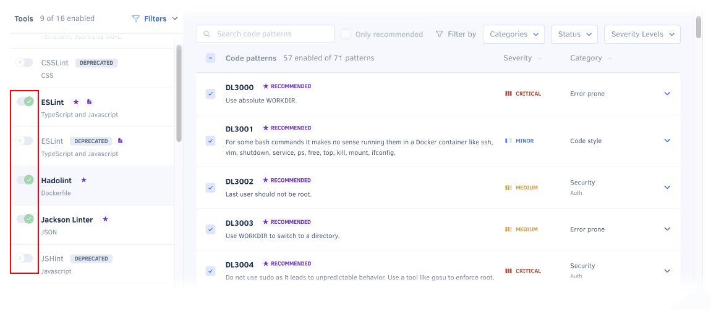

import AdminAccessControlInfo from './../../includes/AdminAccessControlInfo.astro'

<AdminAccessControlInfo />

By default, Codacy analyzes your repositories using a subset of the supported analysis tools and code patterns. These defaults are based on current best practices and community feedback, and you can adapt them to your needs as follows:

-   [Configuring tools and code patterns using the Codacy UI](#configuring-tools-and-code-patterns-using-the-codacy-ui)
-   [Discover code patterns across all tools](#discover-code-patterns-across-all-tools)
-   [Customizing applied coding standards](#using-your-own-tool-configuration-files)
-   [Customizing patterns when following coding standards](#customizing-patterns-following-standards)
-   [Using tool configuration files](#using-your-own-tool-configuration-files)

## Configuring tools and code patterns using the Codacy UI

To configure the tools and code patterns for a repository using the Codacy UI:

1.  Open your repository **Code patterns** page.

    

1.  Enable or disable the tools that Codacy will use to analyze the repository.

    

1.  Select a tool to enable or disable its code patterns. To make it easier to find relevant patterns, use the filters above the pattern list. You can filter by [issue category](../faq/code-analysis/which-metrics-does-codacy-calculate.md#issues), status, severity level, or display only recommended code patterns.

    To see an explanation of the issues that a pattern detects and how to fix them, click the respective dropdown arrow.

    :::tip
    -   To enable a group of code patterns, use the filter to select the relevant group of patterns and click the checkbox in the header of the patterns list.

    -   Codacy displays the tag **New** for one month next to the name of newly added code patterns.
    :::

    

1.  Optionally, to take the changes into account immediately, [reanalyze the repository manually](../faq/repositories/how-do-i-reanalyze-my-repository.md). Otherwise, Codacy will use the updated configuration when analyzing new commits and pull requests.

## Discover code patterns across all tools \{#discover-code-patterns-across-all-tools\}
To discover code patterns across all tools, click **Discover patterns** at the top of the **Tools** list.

Use the input field to search for patterns by name or description. You can also filter by severity level, issue category, recommended or disabled patterns.

You can also expand your search to include patterns from all tools, even if the tool is not enabled for the repository.

## Customizing applied coding standards \{#customizing-applied-coding-standards\}
To apply or edit a repository's [coding standards](../organizations/using-coding-standards.md), click **Customize** in the **Following ...** section at the top of the **Code patterns** page.

Select the coding standards that you want to follow or stop following and click **Apply**.

## Customizing patterns when following coding standards \{#customizing-patterns-following-standards\}
Tools and patterns enabled by a coding standard are enforced and cannot be disabled.
You can add extra tools and patterns, if these are not enabled by any applied coding standard.

## Using tool configuration files \{#using-your-own-tool-configuration-files\}
{/*<!--NOTE
    When adding a new supported tool, make sure that you update the following pages:

    docs/getting-started/supported-languages-and-tools.md
    docs/repositories-configure/local-analysis/client-side-tools.md (if the tool runs client-side)
    docs/organizations/managing-security-and-risk.md  (if the tool reports security issues)
    docs/repositories-configure/configuring-code-patterns.md (supported configuration files table, or list of tools that don't support configuration files)
    docs/repositories-configure/codacy-configuration-file.md (list of tool short names to use on the Codacy configuration file)
-->*/}

:::note
-   After activating a configuration file for a tool, Codacy uses that configuration file even if you [exclude it from Codacy analysis](ignoring-files.md).

-   When [using a tool configuration file alongside a coding standard](../organizations/using-coding-standards.md#using-with-tool-configuration), the configuration file controls the code patterns, while the coding standard controls whether the tool is enabled or disabled.

:::

Codacy supports configuration files for several static analysis tools to help you streamline your setup.

To use a configuration file for a static analysis tool:

1.  Push the configuration file to the root of the [default Codacy branch](managing-branches.md).

1.  Open the repository **Code patterns** page, select the tool of interest, and activate the toggle to use a configuration file.

    :::note
    -   Codacy uses the version of the configuration file **in the branch being analyzed**. For example, if you open a pull request that includes changes to the configuration file, the analysis results take those changes into account.

    -   If Codacy analyzes a branch that doesn't include the configuration file, Codacy reverts to using the code patterns configured for the tool before you selected the option **Configuration file** on the Code patterns page.

    -   For performance reasons, when you update pattern settings using a configuration file, Codacy may display outdated messages for issues identified previously by those patterns.
    :::

    

The table below lists the configuration file names that Codacy detects and supports for each tool:

<table>
  <thead>
    <tr>
      <th>Tool name</th>
      <th>Languages</th>
      <th>Files detected</th>
      <th>Other info</th>
    </tr>
  </thead>
  <tbody>
  <tr>
    <td>Ameba</td>
    <td>Crystal</td>
    <td><code>.ameba.yml</code></td>
    <td></td>
  </tr>
  <tr>
    <td><a href="https://docs.openstack.org/bandit/latest/config.html">Bandit</a></td>
    <td>Python</td>
    <td><code>bandit.yml</code>, <code>bandit.yaml</code>, <code>.bandit</code>, <code>bandit.toml</code>, <code>bandit.ini</code></td>
    <td>To solve flagged valid Python "assert" statements, create a <code>bandit.yml</code> on the root of the repository containing: <code>skips: \['B101'\]</code></td>
  </tr>
  <tr>
    <td>Brakeman</td>
    <td>Ruby</td>
    <td><code>config/brakeman.yml</code></td>
    <td></td>
  </tr>
  <tr>
    <td>Checkstyle</td>
    <td>Java</td>
    <td><code>checkstyle.xml</code></td>
    <td>Supports configuration file in directories other than root and can search up to 5 directories into the repository.</td>
  </tr>
  <tr>
    <td>CodeNarc</td>
    <td>Groovy</td>
    <td><code>.codenarcrc</code></td>
    <td></td>
  </tr>
  <tr>
    <td>Credo</td>
    <td>Elixir</td>
    <td><code>.credo.exs</code>, <code>config/.credo.exs</code></td>
    <td></td>
  </tr>
  <tr>
    <td>dartanalyzer</td>
    <td>Dart</td>
    <td><code>analysis_options.yml</code></td>
    <td><a href="https://dart.dev/guides/language/analysis-options">Customizing static analysis</a></td>
  </tr>
  <tr>
    <td>detekt</td>
    <td>Kotlin</td>
    <td><code>default-detekt-config.yml</code>, <code>detekt.yml</code></td>
    <td>Supports configuration file in directories other than root and can search up to 5 directories into the repository.</td>
  </tr>
  <tr>
    <td>ESLint v8</td>
    <td>JavaScript, TypeScript</td>
    <td><code>.eslintrc.js</code>, <code>.eslintrc.cjs</code>, <code>.eslintrc.yaml</code>, <code>.eslintrc.yml</code>, <code>.eslintrc.json</code></td>
    <td></td>
  </tr>
  <tr>
    <td>ESLint v9</td>
    <td>JavaScript, TypeScript</td>
    <td><code>eslint.config.js</code>, <code>eslint.config.mjs</code>, <code>eslint.config.cjs</code></td>
    <td></td>
  </tr>
  <tr>
    <td>Hadolint</td>
    <td>Dockerfile</td>
    <td><code>.hadolint.yaml</code></td>
    <td></td>
  </tr>
  <tr>
    <td>markdownlint</td>
    <td>Markdown</td>
    <td><code>.markdownlint.yml</code>, <code>.markdownlint.yaml</code>, <code>.markdownlint.jsonc</code>, <code>.markdownlint.json</code></td>
    <td></td>
  </tr>
  <tr>
    <td><a href="https://github.com/squizlabs/PHP_CodeSniffer/wiki/Advanced-Usage">PHP_CodeSniffer</a></td>
    <td>PHP</td>
    <td><code>phpcs.xml</code>, <code>phpcs.xml.dist</code></td>
    <td></td>
  </tr>
  <tr>
    <td>PHP Mess Detector</td>
    <td>PHP</td>
    <td><code>codesize.xml</code>, <code>phpmd.xml</code>, <code>phpmd.xml.dist</code></td>
    <td></td>
  </tr>
  <tr>
    <td>PMD</td>
    <td>Apex, Java, JavaScript, JSP, PL/SQL, XML, Velocity and Visualforce</td>
    <td><code>ruleset.xml</code>, <code>apex-ruleset.xml</code></td>
    <td>Supports configuration file in directories other than root and can search up to 5 directories into the repository.</td>
  </tr>
  <tr>
    <td>Prospector</td>
    <td>Python</td>
    <td><code>.prospector.yml</code>, <code>.prospector.yaml</code>, <code>prospector.yml</code>, <code>prospector.yaml</code>, <code>.landscape.yml</code>, <code>.landscape.yaml</code>, <code>landscape.yml</code>, <code>landscape.yaml</code></td>
    <td></td>
  </tr>
  <tr>
    <td>Pylint</td>
    <td>Python</td>
    <td><code>pylintrc</code>, <code>.pylintrc</code></td>
    <td><a href="https://github.com/codacy/codacy-pylint-python3/blob/master/requirements.txt">Plugins</a></td>
  </tr>
  <tr>
    <td>remark-lint</td>
    <td>Markdown</td>
    <td><code>.remarkrc</code>, <code>.remarkrc.json</code>, <code>.remarkrc.yaml</code>, <code>.remarkrc.yml</code>, <code>.remarkrc.js</code></td>
    <td></td>
  </tr>
  <tr>
    <td>Revive</td>
    <td>Go</td>
    <td><code>revive.toml</code></td>
    <td></td>
  </tr>
  <tr>
    <td>RuboCop</td>
    <td>Ruby</td>
    <td><code>.rubocop.yml</code>, <code>.rubocop-codacy.yml</code></td>
    <td>Supports alternative configuration file <code>.rubocop-codacy.yml</code> for Codacy analysis, allowing exclusion of private gems. This prevents analysis issues caused by private gem references, ensuring proper validation by Codacy.</td>
  </tr>
  <tr>
    <td>Ruff</td>
    <td>Python</td>
    <td><code>pyproject.toml, ruff.toml, .ruff.toml</code></td>
    <td></td>
  </tr>
  <tr>
    <td>Scalastyle</td>
    <td>Scala</td>
    <td><code>scalastyle-config.xml</code>, <code>scalastyle_config.xml</code></td>
    <td></td>
  </tr>
  <tr>
    <td>Semgrep</td>
    <td>Apex, C++, C#, Dockerfile, Elixir, GitHub Actions, Go, Java, JavaScript, Kotlin, PHP, Python, Ruby, Rust, Scala, Shell, Swift, Terraform, TypeScript</td>
    <td><code>.semgrep.yaml</code></td>
    <td></td>
  </tr>
  <tr>
    <td>SonarC#</td>
    <td>C#</td>
    <td><code>SonarLint.xml</code></td>
    <td></td>
  </tr>
  <tr>
    <td>SonarVB</td>
    <td>Visual Basic</td>
    <td><code>SonarLint.xml</code></td>
    <td></td>
  </tr>
 <tr>
    <td>Spectral</td>
    <td>AsyncAPI, OpenAPI</td>
    <td><code>.spectral.yaml</code>, <code>.spectral.yml</code>, <code>.spectral.json</code></td>
    <td></td>
  </tr>
  <tr>
    <td>SpotBugs</td>
    <td>Java, Scala</td>
    <td><code>findbugs.xml</code>, <code>findbugs-includes.xml</code>, <code>findbugs-excludes.xml</code>, <code>spotbugs.xml</code>, <code>spotbugs-includes.xml</code>, <code>spotbugs-excludes.xml</code></td>
    <td>Supports configuration file in directories other than root and can search up to 5 directories into the repository.</td>
  </tr>
    <tr>
    <td>SQLFluff</td>
    <td>SQL</td>
    <td><code>setup.cfg</code>, <code>tox.ini</code>, <code>pep8.ini</code>, <code>.sqlfluff</code>, <code>pyproject.toml</code></td>
    <td>Supports configuration file in directories other than root</td>
  </tr>
  <tr>
    <td>Stylelint</td>
    <td>CSS, LESS, SASS</td>
    <td><code>.stylelintrc</code>, <code>stylelint.config.js</code>, <code>.stylelintrc.json</code>, <code>.stylelintrc.yaml</code>, <code>.stylelintrc.yml</code>, <code>.stylelintrc.js</code></td>
    <td>Supports configuration file in directories other than root and can search up to 5 directories into the repository.</td>
  </tr>
  <tr>
    <td>SwiftLint</td>
    <td>Swift</td>
    <td><code>.swiftlint.yml</code></td>
    <td></td>
  </tr>
  <tr>
    <td>TSQLLint</td>
    <td>Transact-SQL</td>
    <td><code>.tsqllintrc</code></td>
    <td></td>
  </tr>
  </tbody>
</table>

:::note
Codacy doesn't support configuration files for the following tools:

-   Aligncheck
-   Checkov
-   Clang-Tidy
-   Codacy Scalameta Pro
-   CoffeeLint
-   Cppcheck
-   deadcode
-   Flawfinder
-   Gosec
-   Jackson Linter
-   Lizard
-   PSScriptAnalyzer
-   ShellCheck
-   SQLint
-   Staticcheck
-   Trivy
-   Unity Roslyn Analyzers

:::

## See also

-   [Applying a coding standard across multiple repositories](../organizations/using-coding-standards.md)
-   [How to implement Google JavaScript style guide with Codacy](https://blog.codacy.com/implement-google-javascript-style-guide-with-codacy/)
