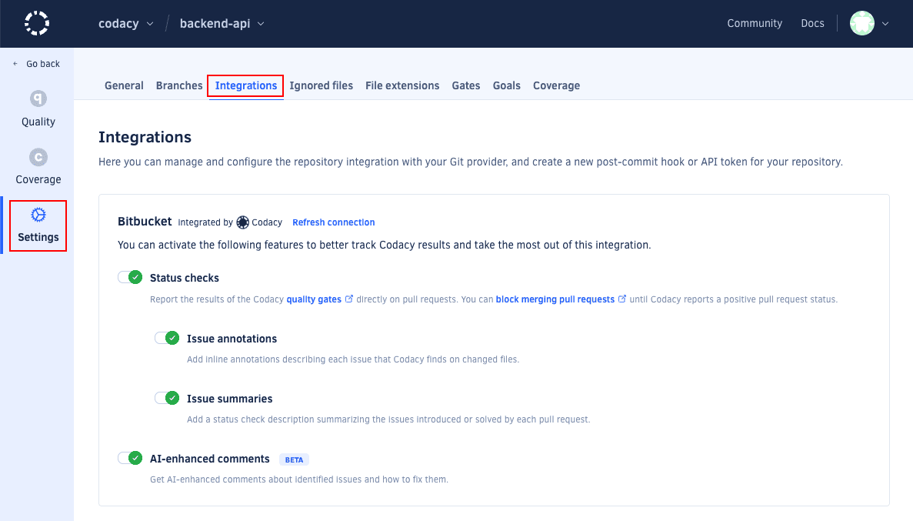
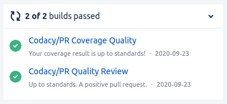
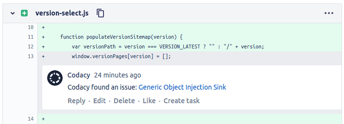
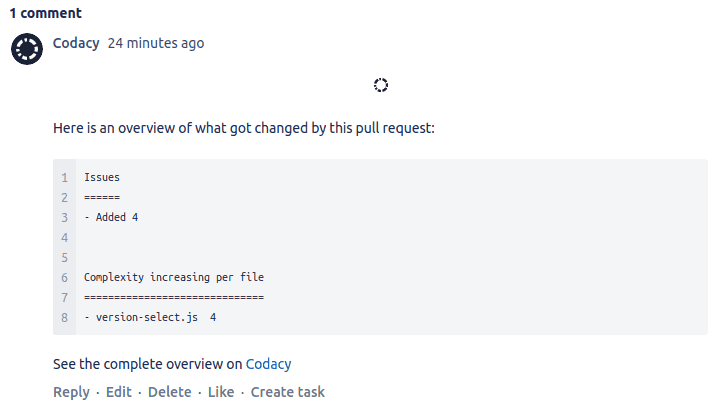
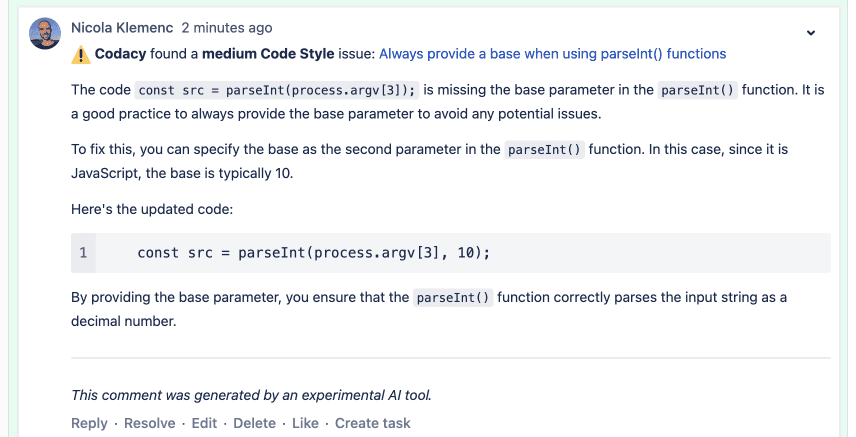
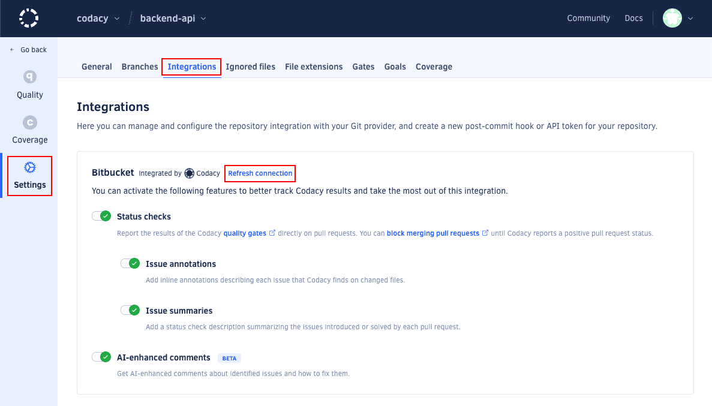

import DefaultGitProviderSettingsTip from './../../../includes/DefaultGitProviderSettingsTip.astro'
import StatusChecksImportant from './../../../includes/StatusChecksImportant.astro'
import AiInfo from './../../../includes/AiInfo.astro'
import ServiceAccountIntegration from './../../../includes/ServiceAccountIntegration.astro'

The Bitbucket integration incorporates Codacy on your existing Git provider workflows by reporting issues and the analysis status directly on your pull requests.

When you add a new repository, Codacy sets the Bitbucket integration using the [default settings for your organization](../../organizations/integrations/default-git-provider-integration-settings.md). You can then [customize the settings](#configuring) for the repository.

:::caution
Codacy uses the Bitbucket user who added the repository to create comments on pull requests. If that user loses access to the repository, a repository admin must [refresh the Bitbucket integration](#refreshing).
:::

## Configuring the Bitbucket integration \{#configuring\}
To configure the Bitbucket integration, open your repository **Settings**, tab **Integrations**.

Depending on the options that you enable, Codacy will automatically update pull requests on Bitbucket with extra information when accepting pull requests.

<DefaultGitProviderSettingsTip variant="apply-all" />

### Status checks \{#pull-request-status\}
Adds a report to your pull requests showing whether your pull requests and coverage are up to standards or not as configured on the [quality gate rules](../../repositories-configure/adjusting-quality-gates.md) for your repository. You can then optionally [block merging pull requests that aren't up to standards](../../getting-started/integrating-codacy-with-your-git-workflow.md#blocking-pull-requests).

<StatusChecksImportant />

### Issue annotations \{#pull-request-comment\}
Adds comments on the lines of the pull request where Codacy finds new issues. Click on the links to open Codacy and see more details about the issues and how to fix them. To enable this option, you must enable **Status checks** first.

### Issue summaries \{#pull-request-summary\}
:::note[This feature isn't available for Bitbucket Server]
:::

Shows an overall view of the changes in the pull request, including new issues and metrics such as complexity and duplication. To enable this option, you must enable **Status checks** first.

### AI-Enhanced Comments

Adds AI-enhanced comments with insights to help you fix identified issues.

<AiInfo />

## Refreshing the Bitbucket integration \{#refreshing\}
If the user who added the repository to Codacy loses access to the repository, which may happen when the user leaves the team or the organization, Codacy won't be able to create comments on pull requests.

In this situation, another user with [administrator access to the repository](../../organizations/roles-and-permissions-for-organizations.md#permissions-for-bitbucket) needs to refresh the Bitbucket integration:

<ServiceAccountIntegration />

1.  Open the repository **Settings**, tab **Integrations**.

1.  On the Bitbucket integration area, click the link **Refresh connection**.

    

After refreshing the integration, Codacy will use the logged in Bitbucket user to create comments on new pull requests.

## See also

-   [Integrating Codacy with your Git workflow](../../getting-started/integrating-codacy-with-your-git-workflow.md)
