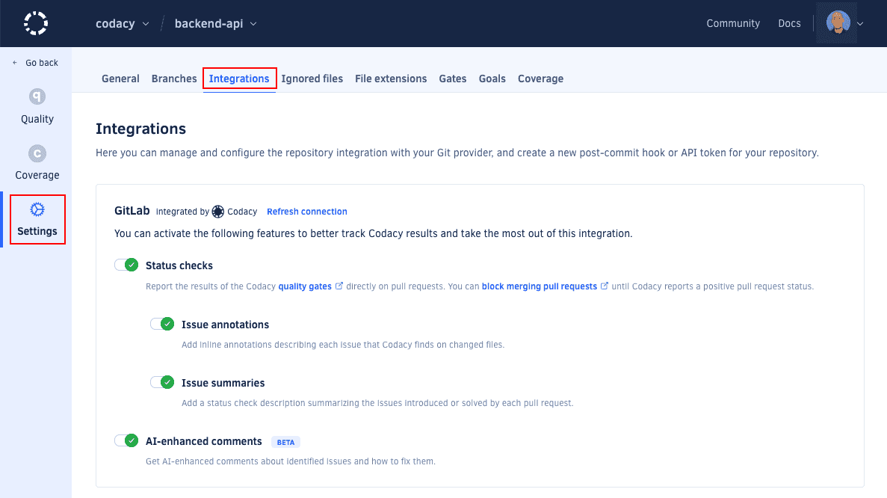

import DefaultGitProviderSettingsTip from '../../_includes/DefaultGitProviderSettingsTip.mdx'
import StatusChecksImportant from '../../_includes/StatusChecksImportant.mdx'
import AiInfo from '../../_includes/AiInfo.mdx'
import ServiceAccountIntegration from '../../_includes/ServiceAccountIntegration.mdx'

The GitLab integration incorporates Codacy on your existing Git provider workflows by reporting issues and the analysis status directly on your merge requests.

When you add a new repository, Codacy sets the GitLab integration using the [default settings for your organization](../../organizations/integrations/default-git-provider-integration-settings.md). You can then [customize the settings](#configuring) for the repository.

:::caution
Codacy uses the GitLab user who added the repository to create comments on merge requests. If that user loses access to the repository, a repository admin must [refresh the GitLab integration](#refreshing).
:::

## Configuring the GitLab integration \{#configuring\}
To configure the GitLab integration, open your repository **Settings**, tab **Integrations**.

Depending on the options that you enable, Codacy will automatically update merge requests on GitLab with extra information when accepting merge requests.

<DefaultGitProviderSettingsTip variant="apply-all" />

### Status checks \{#pull-request-status\}
Adds a report to your merge requests showing whether your merge requests and coverage are up to standards or not as configured on the [quality gate rules](../../repositories-configure/adjusting-quality-gates.md) for your project. You can then optionally [block merging merge requests that aren't up to standards](../../getting-started/integrating-codacy-with-your-git-workflow.md#blocking-pull-requests).

<StatusChecksImportant />

### Issue annotations \{#pull-request-comment\}
Adds comments on the lines of the merge request where Codacy finds new issues. Click on the links to open Codacy and see more details about the issues and how to fix them. To enable this option, you must enable **Status checks** first.

### Issue summaries \{#pull-request-summary\}
Shows an overall view of the changes in the merge request, including new issues and metrics such as complexity and duplication. To enable this option, you must enable **Status checks** first.

### Coverage summaries

Adds a pull request comment showing an overall view of the coverage metrics for the pull request, including details about the data that Codacy used to calculate the coverage variation and diff coverage metrics.

When there are new coverage results, Codacy updates the last coverage summary comment if it's included in the last 5 comments of the pull request. Otherwise, Codacy creates a new comment.

:::caution
**To get coverage summaries** you must also [add coverage to your repository](../../coverage-reporter/index.md).
:::

:::note
This feature is only supported on GitHub and GitLab Cloud.
:::

### AI-Enhanced Comments

Adds AI-enhanced comments with insights to help you fix identified issues.

<AiInfo />

## Refreshing the GitLab integration \{#refreshing\}
If the user who added the repository to Codacy loses access to the repository, which may happen when the user leaves the team or the organization, Codacy won't be able to create comments on merge requests.

In this situation, another user with [administrator access to the repository](../../organizations/roles-and-permissions-for-organizations.md#permissions-for-gitlab) needs to refresh the GitLab integration:

<ServiceAccountIntegration />

1.  Open the repository **Settings**, tab **Integrations**.

1.  On the GitLab integration area, click the link **Refresh connection**.

    

After refreshing the integration, Codacy will use the logged in GitLab user to create comments on new merge requests.

## See also

-   [Integrating Codacy with your Git workflow](../../getting-started/integrating-codacy-with-your-git-workflow.md)
