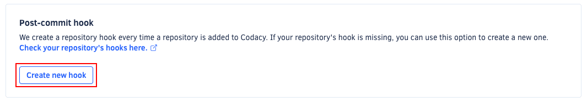

When you add a new repository to Codacy, Codacy automatically creates a repository hook on your Git provider to check for new commits and pull requests. This post-commit hook enables Codacy to trigger an analysis to run immediately after you push code to your repository.

:::caution
Don't change the configuration of the hooks created by Codacy on your Git provider, as it might cause service failure.
:::

## Creating a new post-commit hook

In case your repository’s hook is missing from your Git provider, you can create a new one:

1.  Open your repository **Settings**, tab **Integrations**.
1.  On the **Post-commit hook** area, click the button **Create new hook**.

