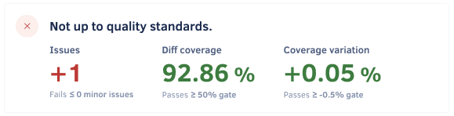
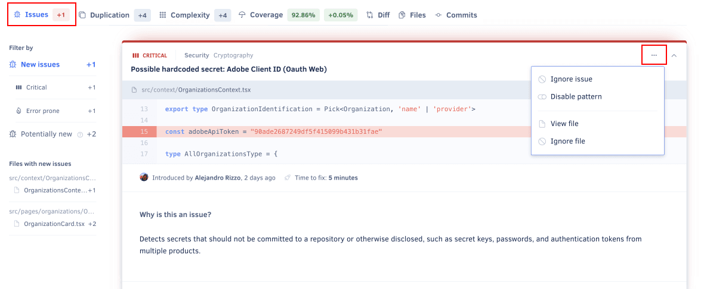
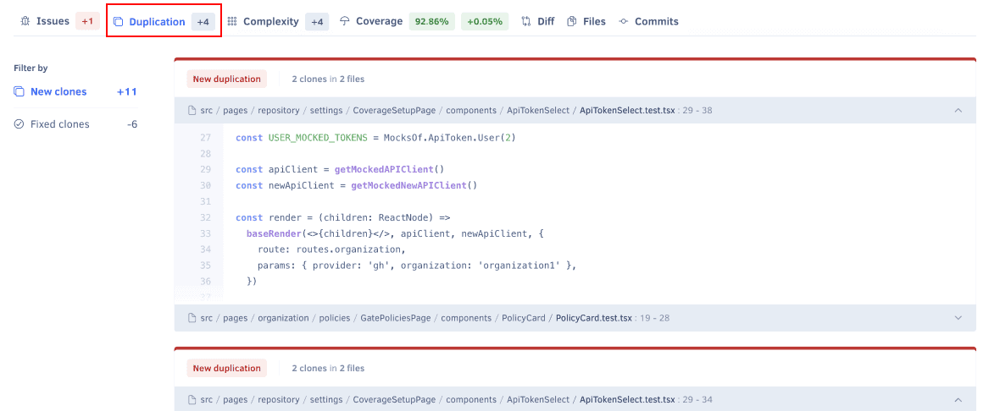
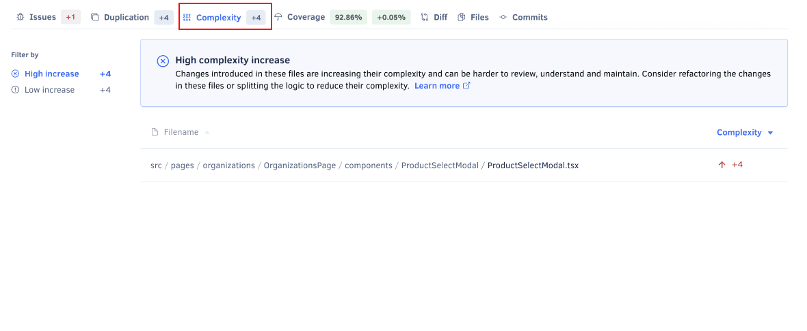
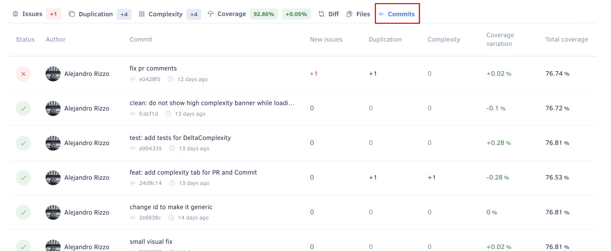
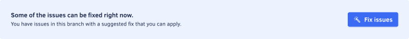

import IssueDetails from '../_includes/IssueDetails.mdx';

The **Pull Requests page** displays an overview of the pull requests in your repository, such as the analysis status and the code quality metrics for each pull request. This allows you to monitor the code quality of the work in progress in your repository.

By default, the page lists open pull requests, but you can click the **Closed** tab at the top of the list to display the closed pull requests.

Click a specific pull request to see detailed information about the code quality changes introduced by that pull request.

The next sections describe each area of the pull request detail page.

## Pull request status {#status}
This area displays the information that identifies the pull request (name, author, head and base branches, and last updated date), as well as:

-   A link to the pull request on your Git provider
-   A [link to reanalyze the latest pull request commit](../faq/repositories/how-do-i-reanalyze-my-repository.md), present when the committer [is part of your organization](../organizations/managing-people.md)
-   A link to [view analysis logs](#viewing-analysis-logs)

## Pull request quality overview {#quality-overview}
<!-- vale off -->

<!-- vale on -->

This area displays the quality gate status for the pull request and the code quality metrics [with a gate set up](../repositories-configure/adjusting-quality-gates.md):

-   The quality gate status is either **Up to quality standards** or **Not up to quality standards** depending on the [quality gate rules](../repositories-configure/adjusting-quality-gates.md) for your repository.

    If there are no gate rules enabled for pull requests, the status is always **Up to quality standards**.

-   The variation introduced by the pull request is displayed either as a **positive or negative variation**, **no variation** (represented by `=`), **not applicable** (represented by `∅`), for code quality metrics [with a gate set up](../repositories-configure/adjusting-quality-gates.md):

    -   **Issues:** Number of new issues
    -   **Duplication:** Changes in the number of duplicated code blocks
    -   **Complexity:** Changes in code complexity
    -   **Diff coverage:** Code coverage of the coverable lines affected by the pull request, or `∅` (not applicable) if there are no coverable lines
    -   **Coverage variation:** Changes in code coverage percentage compared with the target branch

    Depending on the languages being analyzed or if you haven't [set up coverage for your repository](../coverage-reporter/index.md), some metrics **may not be calculated** (represented by `-`).

    :::note
    Learn how Codacy calculates the code quality metrics in more detail:

    -   [Which code quality metrics does Codacy calculate?](../faq/code-analysis/which-metrics-does-codacy-calculate.md)
    -   [Why does Codacy show unexpected coverage changes?](../faq/code-analysis/why-does-codacy-show-unexpected-coverage-changes.md)
    :::

-   The **colors** depend on the [quality gate rules](../repositories-configure/adjusting-quality-gates.md) for your repository:

    -   **Green:** The metric passes the quality gate
    -   **Red:** The metric fails the quality gate
    -   **Gray:** The metric has no value

    :::note
    If you change the quality gate rules you must reanalyze the pull request to update the metrics and optionally re-upload the Coverage report if you also changed the coverage gate rules.
    :::

## Issues tab {#issues-tabs}
The **Issues** tab displays the lists of issues that the pull request creates or fixes. Use the sidebar filters to filter the list by new issues (including issues of specific severity or category), issues within a specific file, fixed issues, [potential new issues, or potential fixed issues](#possible-issues).

<IssueDetails />

To [ignore or manage an issue](issues.md#ignoring-and-managing-issues), click the associated options in the menu.

### Potential issues {#possible-issues}
Codacy may label some issues as **potential**, which means that the code analysis detected these issues in lines of code that weren't changed by the analyzed pull request. This highlights potential consequences in other parts of your codebase.

The following are example situations that can lead to potential issues:

-   The issue was either created or fixed in the current pull request, but the static code analysis tools reported the issue on a line that didn't change in the pull request. For example, if you remove the line containing the declaration of a variable you may get an "undeclared variable" issue in other lines that use that variable.

-   If a file had [more than 50 issues reported by the same tool](../faq/code-analysis/does-codacy-place-limits-on-the-code-analysis.md) and you push a new commit that fixes some of these issues, Codacy will report more issues until the limit of 50 issues. These issues will be potential issues if they're outside the lines of code changed in the new commit.

:::note
**If you're using GitHub** you may see [annotations](../repositories-configure/integrations/github-integration.mdx#issue-annotations) for potential issues reported under **Unchanged files with check annotations** on the **Files changed** tab of your pull requests.

This happens when Codacy reports potential issues in files that weren't changed in your pull request. [Read more about this GitHub feature](https://developer.github.com/changes/2019-09-06-more-check-annotations-shown-in-files-changed-tab/).

:::

## Duplication tab {#duplication-tabs}
The **Duplication** tab displays the lists of clones (duplicated code blocks) that the pull request adds or fixes. You can click a clone to expand it and inspect the code.

## Complexity tab

The **Complexity** tab displays the complexity changes introduced by the pull request. Use the sidebar filters to filter the list by high increase (4 or more), low increase (1 to 3), or improvement (less than 0).

:::note
For more information, see [how Codacy calculates cyclomatic complexity](../faq/code-analysis/which-metrics-does-codacy-calculate.md#complexity).
:::

## Diff tab

The **Diff** tab displays the code changes and issues introduced by the pull request. It includes the following areas:

-   A **list of files** modified by the pull request, with additional information for each file:

    -   A **green plus icon** if the file is added or a **yellow dot icon** if it's modified by the pull request
    -   The **number of new issues** introduced by the pull request

-   A **diff viewer** showing for each modified file the diff coverage and a comparison of the old and new file content.

    Lines with issues are highlighted according to issue severity and include a pill label with the issue type and count. Hover over the pill label to view more details or navigate to the issues.

<!-- vale off -->

<!-- vale on -->

## Files tab

The **Files** tab displays the variation of the following [code quality metrics](../faq/code-analysis/which-metrics-does-codacy-calculate.md) that the pull request introduces to the files in your repository, displayed either as a **positive or negative variation**, or **no variation** (represented by `=`):

-   **New issues:** Number of new issues
-   **Duplication:** Changes in the number of duplicated code blocks
-   **Complexity:** Changes in code complexity
-   **Coverage variation:** Changes in code coverage percentage compared with the target branch

Depending on the languages being analyzed or if you haven't [set up coverage for your repository](../coverage-reporter/index.md), some metrics **may not be calculated** (represented by `-`).

<!-- vale off -->

<!-- vale on -->

## Commits tab

The **Commits** tab displays an overview of each commit included in the pull request, such as the analysis status and the number of issues introduced.

Click a specific commit to see [detailed information about that commit](commits.mdx#status).

## Viewing analysis logs

Analysis logs can help you track and understand the performance of the tools and the timing of analyses on your pull requests.

To access these logs, click the **View logs** link in the [pull request status](#status) area. This opens a modal with two tabs:

-   The **Quality** tab displays execution times and outcomes for the tools used to analyze the latest commit of the pull request. It helps identify the duration of each analysis phase and any potential issues.
-   The **Coverage** tab lists reports received for the common ancestor commit and the head commit of the pull request. It helps you spot any issues with the coverage analysis, such as missing coverage reports.

## Fixing issues automatically

:::note[This section applies to GitHub repositories only]
:::

If Codacy detects code patterns with suggested fixes, a **Fix issues** button appears above the issue list.

In this case, Codacy generates a patch that enables you to solve all resolvable issues. To apply this patch to the pull request, do the following:

1.  Click the button **Fix issues** to open a modal with a patch that addresses all resolvable issues.

    

1.  Copy the patch content to the clipboard.
1.  Check out the relevant branch in the local repository.
1.  Apply the patch from the repository's root directory, for example with the `pbpaste | patch` command.

    :::note
    These changes are automatically generated. Review them to make sure they're correct.
    :::

1.  Push the changes to the repository.

## See also

-   [Which metrics does Codacy calculate?](../faq/code-analysis/which-metrics-does-codacy-calculate.md)
